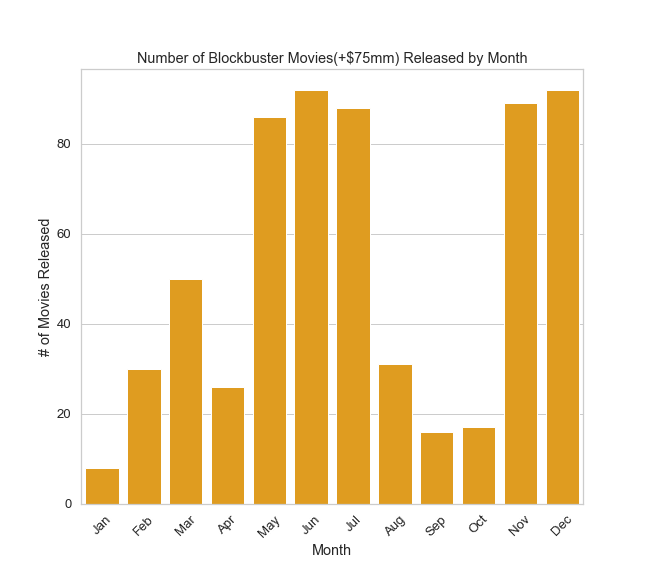
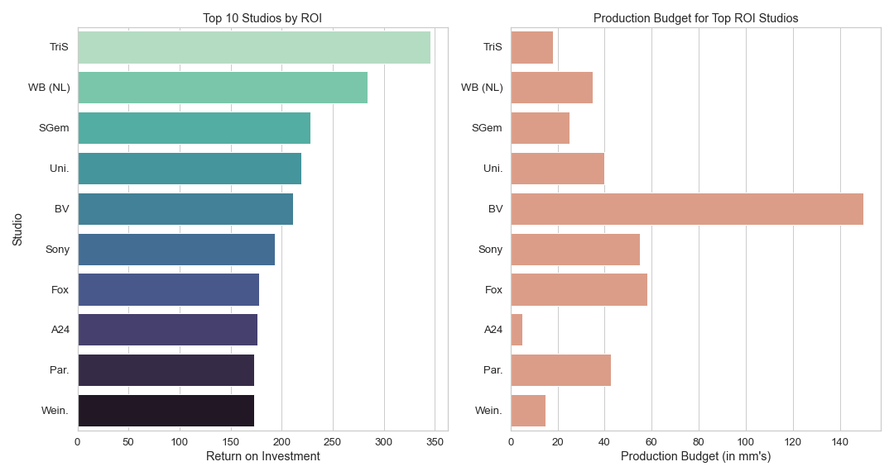
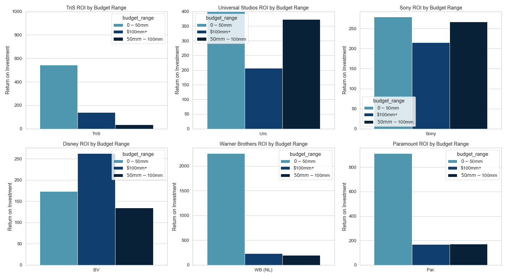

#  Analytical Insights into Making a Succesful Movie:

Microsoft is looking to expand its footprint outside of their core lines of business, and start a new movie studio arm. The goal of our project is to analyze movie data in order to provide meaningful insights for Microsoft's new movie studio. The analysis provided answers some of the main questions a movie studio would ask for such a business venture to be successful, namely, when to release a prospective film, which genres to produce, and which studios to use, all in an attempt to generate the highest rate of return for Microsoft and their clients.

## Data

Data used in this project comes from the following sources:

* Box Office Mojo
* IMDB
* Rotten Tomatoes
* TheMovieDB.org

**Data can be found in the zippedData folder**

The below key is a reference to the files used and the primary key used to join tables for analysis.
 
! [Data_Key](images/datakey.png) 

The main files used were:

* bom.movie_gross
* imdb.title.basics
* tmdb.movies
* tn.movie_budgets

The data provided covers gross revenue, production budget, and other categorical data like genres and studios for a dataset that inlcudes thousands of past movies.

The target variable for this analysis is return on investment (ROI) which can be deduced from our financial related data provided in the files referenced above.

## Business Problem

The main business concern for Microsoft is turning a profit for their new studio business line or being able to demonstrate a clear path to profitability over time. Without being able to turn a profit, it is unlikely Microsoft will want to continue to keep such a business unit active if it means losing money every quarter, when they can deploy that capital elsewher. 

In order to maximize profitability potential, we need to consider the most practical variables that contribute to profitability. With this in mind, we investigated the following three main questions:
1. What genres are most successful in terms of return on investment (ROI)?
2. Which months are lead to highest viewer participation and ROI?
3. Which Studio has a track record of producing high grossing and ROI films?

Answering these questions and would provide Microsoft with baseline insights prior to entering the entertainment industry.

## Key Findings

### What movie genres produce the highest ROI?

Here I tried to analyze whether there is an advantage producing a films of a particular genre. We looked at the worldwide gross revenue and production budget to back into profit and ROI of each film in our budget data (**tn.movie_budgets** ). The budget data needed to be cleaned first in order to do this, which required converting the datatypes of our budget related data from objects to integers to be able to create our profit and ROI columns. After the original file was cleaned and Profit and ROI columns were created we needeed to join our budget data with our categorical data (**imdb.title.basics**) for genres.

After these files were joined using movie name, we needed to do some further cleaning of the joined dataframe including dropping duplicate rows created from the join, and using a lambda function to get our relevant genre data into a format by which we could use to analyze. 

Through further investigation, it was decided that genres with less than 10 observations would be remvoed from our data as they would skew the results of ourfindings

*To note, some movies had multiple genres associated such as 'Horror, Mystery, and Thriller' for an individual film and I made the assumption that the first most genre was the most descriptive of the related movie.

Here are our key findings:
1. The genres that generate the highest ROI are Adventure, Horror, Sci-Fi, Action and Animation, respectively
2. Each genre has a different production cost associated with it 

**Reccomendations**

1. In order to maximize return of your prospective film, use the above as a guide for target ROI
2. If budget constraint is a material factor in deciding a genre, Horror requires the smallest budget 

### When are the best months to release a film?

The intent of this question was to analyze months in which it is beneficial or detrimental to release a film from a profitability and viewership perspective. The two main data sets used here were budgets (tn.movie_budgets) and audience related (tmdb.movies). Budgets is used again here as the target variable for most of our analysis was to optimize ROI, while our audience related data provided us with vote_count, popularity, and vote_average from which we can derive viewer engagement. Our new data table needed to be cleaned for duplicate entries and both tables converted release_date column to datetime. Both tables were used to create their own groupby with mean, median, and count aggregates so they both could be plotted based of each tables respective as we lost nearly 80-90% of data on by joining. A dataframe was made for large budget movies that were 1 std away from the median value of production budgets.

Here are our key findings:

1. Months with highest viewer participation also correspond to high Gross Revenue and ROI
2. While a high production budget doesn't mean a film will get good reviews, it is indicative of viewer turnout  
3. These high ROI and viewer participation months are also same months when most blockbuster films are released

**Recommendations**

1. Avoid releasing a movie in months where viewers are less engaged and ROI is smallest i.e. January, October, and September
2. If the production budget of the film is enough to compete with the other blockbuster films, release in months with best ROI and viewer participation i.e. June, July, November, and December otherwise consider 'second tier' months in order to avoid being crowded out by larger headline films

### Which studio(s) have a proven track record of making profitable movies?

In this analysis, we wanted to see whivh studios have the highest ROI. We used our studio dataset **bom_movie_gross_gz** for this analysis. This data set needed to be cleaned and joined with our existing budget data set in order to answer our question. The studio data required cleaning of Na values and converting column datatypes using a map lambda function. When joined with our budget data we grouped our data by studio and filtered for studios that have made more than 10 movies as we are only interested in using established movie studios. Lastly, a new column was made to classify budget range using a map lambda function. This allowed us to view studios success given varying sets of budget constraints  

Here are our key findings:

1. Some of the studios with the highest ROI are more a factor of prodcution budget of the film being low
2. Different studios have expertise in making films with varying production budgets

|

**Recommendations**

When selecting a studio for a film Microsoft should consider the production budget of the film. For the following production budgets they should consider these studios:

    -Low budget(0-50mm) film: TriS, Paramount, or Warner Brothers
    -Medium Budget(50-100mm) film: Universal Studios or Sony
    -High Budget(>100mm)film: Disney or Warner Brothers

## Conclusion

Prior to making any decisions Microsoft needs to asses their budget constraints, as their most profitable path forward varies by production budget. 

1. For a low budget film, I would suggest a horror movie released in March or August, using Warner Brothers Studio
2. For a high budget film, I would suggest an Action or Adventure movie, released in July or November, using Disney or Sony as a studio
    
Some limitations to the our analysis are that our sample population of data is does not accurately depict the current movie market as when our data sets where joined we only had some 1200 movies to work with.

### Future Work

To further improve upon this analysis, it would be helpful to analyze which studios are best making specific genre types as well as investigating directors and actors that are known for being in or directing certain genres of film.

Additionally, it would be interesting to analyze how movies released over streaming platforms such as Netflix or Hulu as they release exclusive content as well and have introduced a paradigm shift to the entertainment industry as a whole
